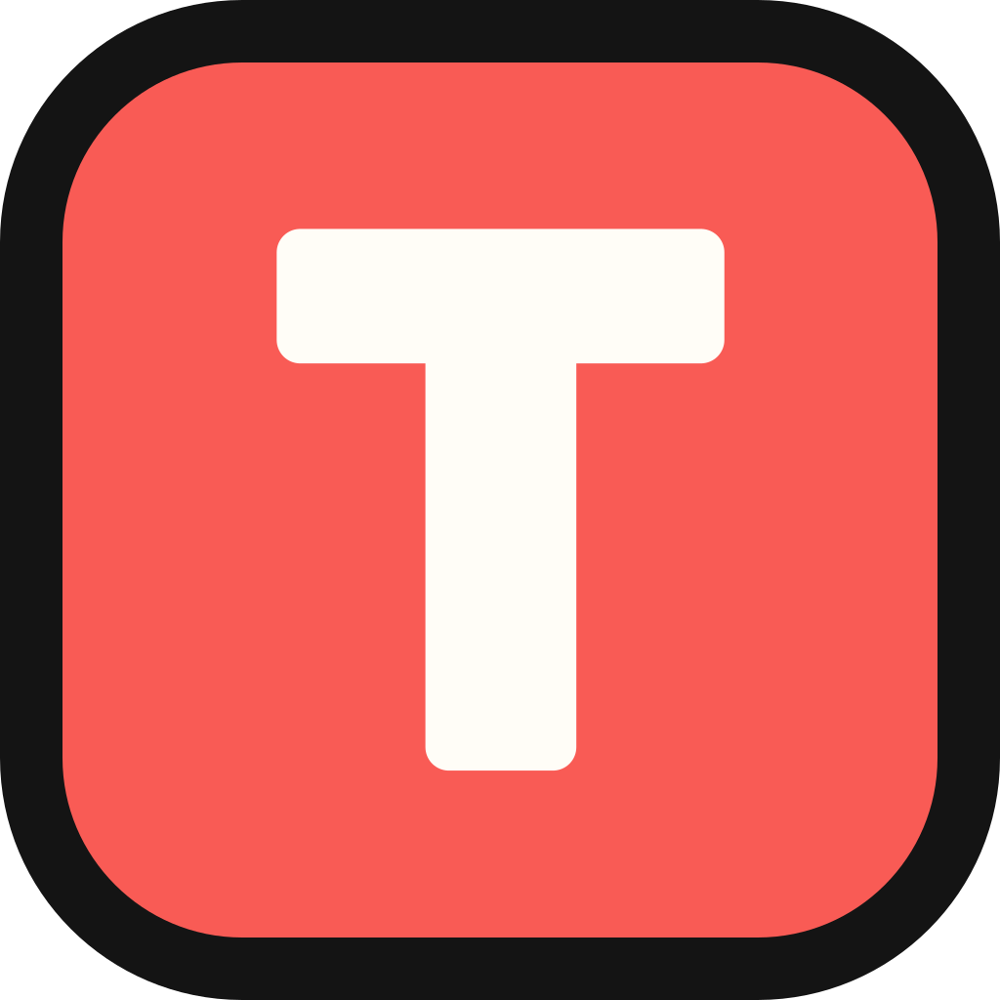
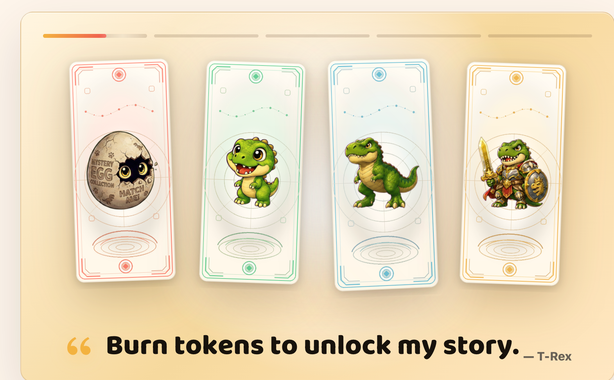
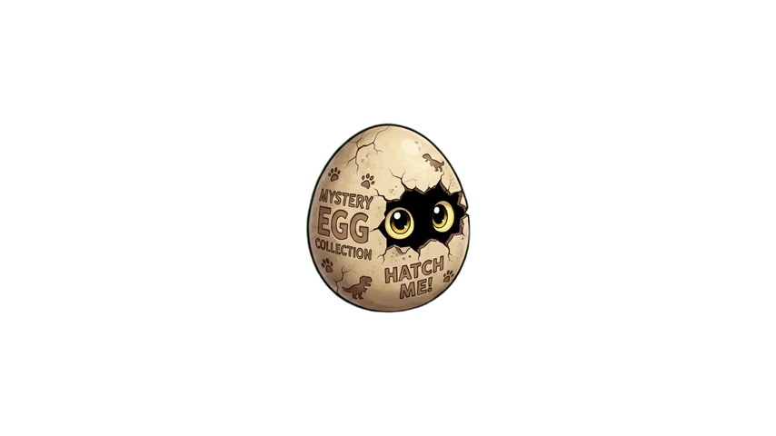
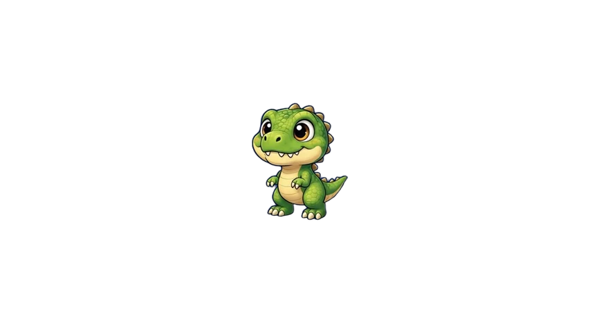
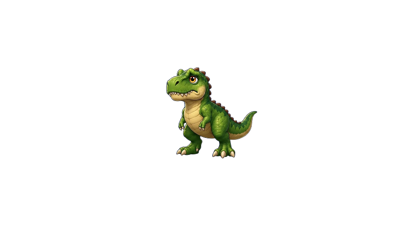
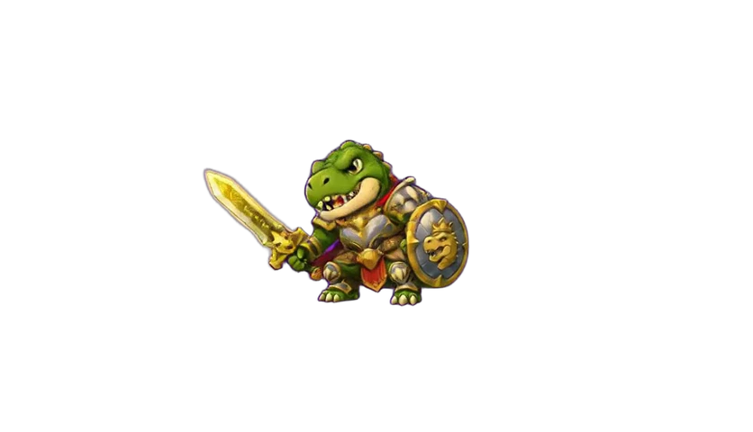

<p align="center">
  
</p>

<h1 align="center">🦖 TokeyPal — <a href="https://tokeypal.com">tokeypal.com</a></h1>

> ✨ Your tokens hatch today's creature story. ✨

<p align="center">
  
</p>

🖥️ A native macOS menu-bar pet that evolves with your AI coding token usage.

## ⭐ Features

- 🪶 **Swift-native & featherweight** — built entirely in Swift + AppKit. Tiny CPU and memory footprint.
- 📊 **Lives in your menu bar** — an always-on companion; one click opens the usage dashboard.
- 🥚➡️🐉 **Usage → evolution engine** — your pet advances through 4 stages as you burn tokens through the day.

<p align="center">
   &nbsp;
   &nbsp;
   &nbsp;
  
</p>

<p align="center">🥚 → 🦖 → 🦕 → ⚔️🐉</p>

## 🚀 How to use

📥 **Download** — grab the latest `TokeyPal.app` from [Releases](../../releases). 🍎 macOS 14+, universal binary (Intel + Apple Silicon).

🛠️ **Or build it yourself:**

```bash
swift build              # 🔨 build (swift test to run tests)
./scripts/build-app.sh   # 📦 package → .build/app/TokeyPal.app
```

## 📄 License

MIT — see [LICENSE](./LICENSE). 🙏 Bundles [ccusage](https://github.com/ryoppippi/ccusage) (MIT) for local usage parsing.
